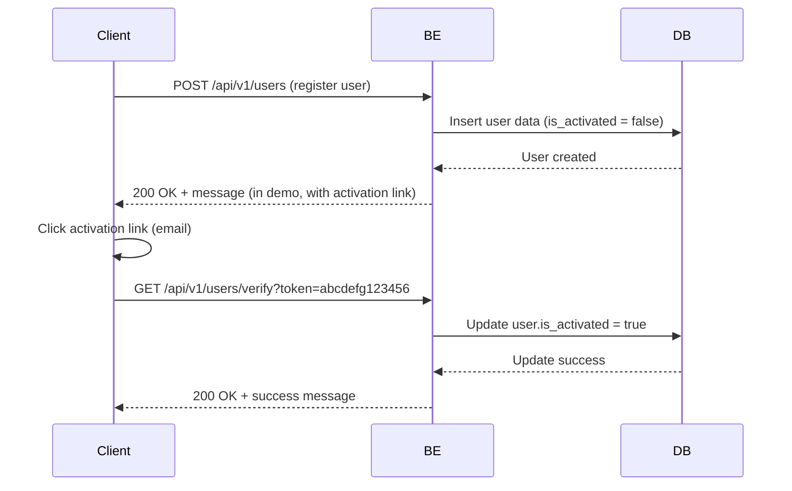

# Flow



# APIs

## User Registration API

**POST** `/api/v1/users`

**Request Body**

```
{
    "email":"test92@gmail.com", //required, string
    "password":"testpswD@" //required, string
}
```

**Response**

`200` OK

```
{
    "version": "1.0.0",
    "error": "",
    "data": "" // would get activation link in this demo
}
```

## Get Activation API

**GET** `/api/v1/users/verify?token=abcdefg123456`

**Request Header**

```
Content-Type: application/json
```

**Response**
`200` OK

```
{
    "version": "1.0.0",
    "error": "",
    "data": ""
}
```
