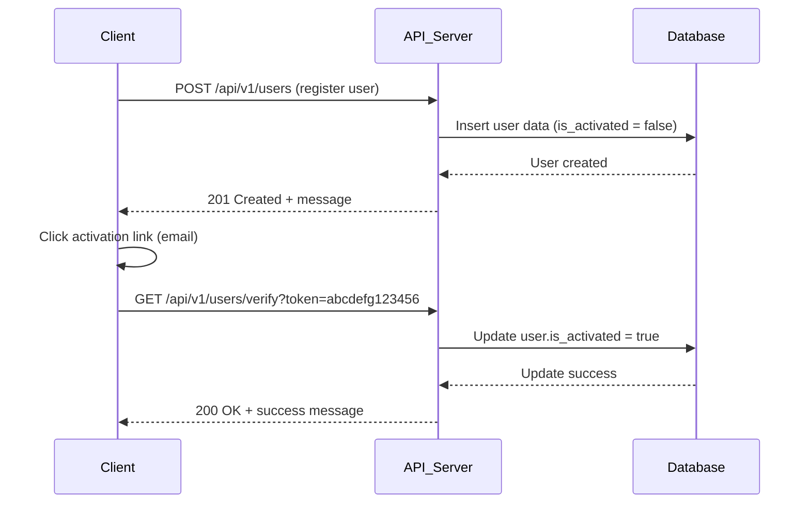

# Flow

## Mermaid Sequence Diagram

```mermaid
sequenceDiagram
    participant Client
    participant API_Server
    participant Database

    Client->>API_Server: POST /api/v1/users (register user)
    API_Server->>Database: Insert user data (is_activated = false)
    Database-->>API_Server: User created
    API_Server-->>Client: 201 Created + message

    Client->>Client: Click activation link (email)
    Client->>API_Server: GET /api/v1/users/verify?token=abcdefg123456
    API_Server->>Database: Update user.is_activated = true
    Database-->>API_Server: Update success
    API_Server-->>Client: 200 OK + success message
```
